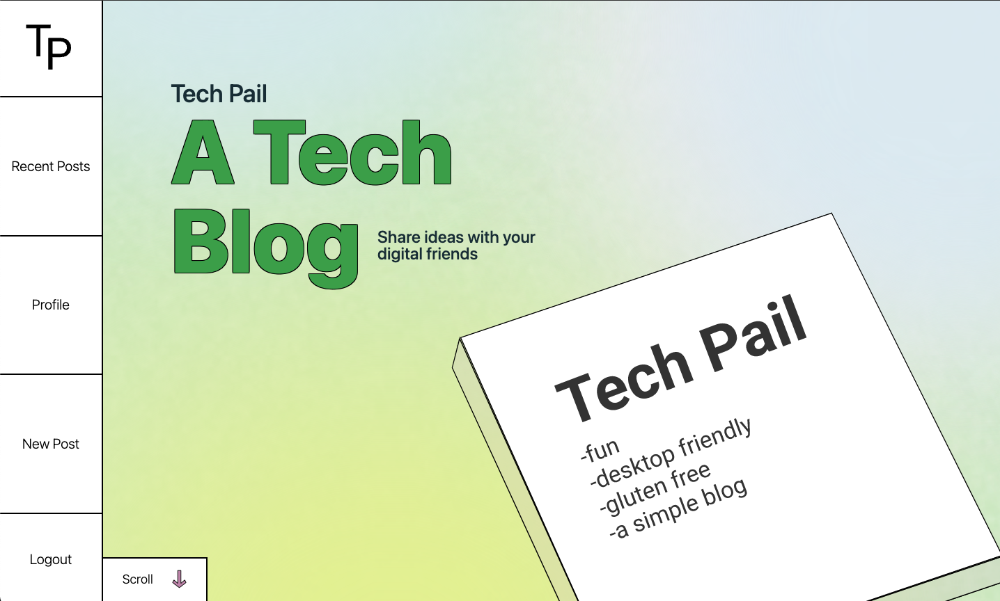

# theTechPail

[](https://opensource.org/licenses/MIT)

## Description

TechPail is a full-stack tech blog built with:

- Node + Express
- Handlebars templates
- Sequelize ORM
- Session-based authentication
- Tailwind CSS

This demo branch is configured for easy deployment on Render using Postgres.
The original project was built on MySQL/JAWSDB for Heroku.



## Local Setup

1. Install dependencies:

```bash
npm install
```

2. Create `.env` from `.env.example`.

3. Run in dev mode:

```bash
npm run dev
```

## Environment Variables

Preferred for Render:

- `DATABASE_URL` (Render Postgres connection string)
- `SESSION_SECRET` (random secret string)
- `NODE_ENV=production`

Optional local fallback (legacy MySQL path):

- `DB_NAME`
- `DB_USER`
- `DB_PASSWORD`

## Deploying to Render

Web service settings:

- Build Command: `npm ci && npm run build:css`
- Start Command: `npm start`

Set env vars in Render:

- `DATABASE_URL`
- `SESSION_SECRET`
- `NODE_ENV=production`

Quickest path: deploy from `render.yaml` using Render Blueprint.

See `/docs/render-deploy-checklist.md` for the exact click path and verification steps.

See `/docs/fork-to-render-playbook.md` for the full fork-equivalent and deployment workflow.

## License

MIT
Copyright 2023 jakeroth0

Permission is hereby granted, free of charge, to any person obtaining a copy of
this software and associated documentation files (the "Software"), to deal in
the Software without restriction, including without limitation the rights to
use, copy, modify, merge, publish, distribute, sublicense, and/or sell copies
of the Software, and to permit persons to whom the Software is furnished to do
so, subject to the following conditions:

The above copyright notice and this permission notice shall be included in all
copies or substantial portions of the Software.

THE SOFTWARE IS PROVIDED "AS IS", WITHOUT WARRANTY OF ANY KIND, EXPRESS OR
IMPLIED, INCLUDING BUT NOT LIMITED TO THE WARRANTIES OF MERCHANTABILITY,
FITNESS FOR A PARTICULAR PURPOSE AND NONINFRINGEMENT. IN NO EVENT SHALL THE
AUTHORS OR COPYRIGHT HOLDERS BE LIABLE FOR ANY CLAIM, DAMAGES OR OTHER
LIABILITY, WHETHER IN AN ACTION OF CONTRACT, TORT OR OTHERWISE, ARISING FROM,
OUT OF OR IN CONNECTION WITH THE SOFTWARE OR THE USE OR OTHER DEALINGS IN THE
SOFTWARE.

## Questions

If you have any questions about the repo, open an issue or contact me directly
at `jakeroth0@gmail.com`. You can find more of my work on GitHub at
[jakeroth0](https://github.com/jakeroth0).
